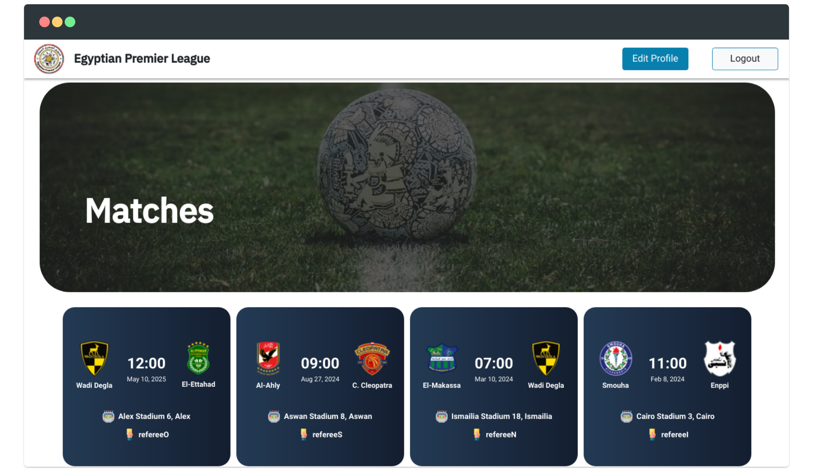
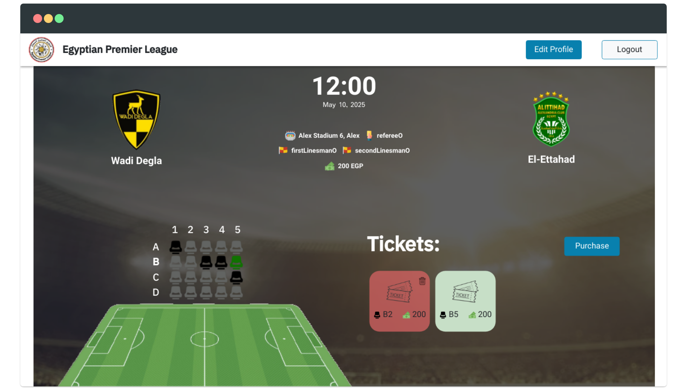

# Match Reservation System
Webapp for `Egyptian Premier League`, with it you can reserve your seat on future matches.

> This project is NOT affiliated with or related to the `Egyptian Premier League` in any way. This was a college project done merely for educational purposes.

## Screenshots
## Home Page


## Matches Page


## Match Page


## Build
See both [frontend README](frontend/README.md) and [backend README](backend/README.md) for guides on how to setup and run the webapp.

## Stack
Built with `MERN` stack:
- `Mongodb` for DB.
- `Nodejs` and `ExpressJS` for backend.
- `ReactJS` for frontend (SPA).

## API
`API` is written in `openapi` format.

You can generate different clients for our api using `openapi-generator`.
See `makefile` on how it generates the typescript client.

### Build API docs
```
$ make docs
```

## Frontend Design
### Wireframe
[Website Wireframe](wireframe.png) with draw.io

### Mockup
We designed the frontend with [Figma](figma.com), see [FigmaMockup.fig](FigmaMockup.fig) file.

## License
Licensed under [The Non-Profit Open Software License version 3.0 (NPOSL-3.0)](https://opensource.org/licenses/NOSL3.0). See [LICENSE](LICENSE).
