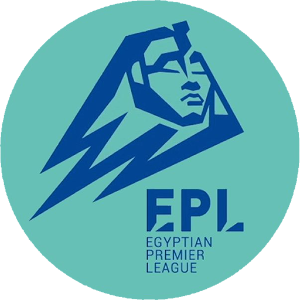
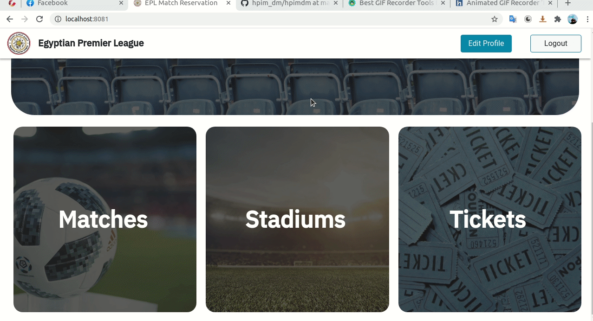

<br />
<br />
<p align="center">
  <a href="https://github.com/mido3ds/match-reservation-system">
    
  </a>
  
  <h3 align="center">:soccer: Match Reservation System :ticket:</h3>

  <p align="center">
      Webapp for Egyptian Premier League, with it you can reserve your seat on future matches
  </p>
</p>

</div>

<div align="center">

[](https://github.com/mido3ds/match-reservation-system/contributors)
[](https://github.com/mido3ds/match-reservation-system/issues)
[](https://github.com/mido3ds/match-reservation-system/network)
[](https://github.com/mido3ds/match-reservation-system/stargazers)
[](https://github.com/mido3ds/match-reservation-system/blob/master/LICENSE)

</div>

> This project is NOT affiliated with or related to the `Egyptian Premier League` in any way. This was a college project done merely for educational purposes.

# :camera: Screenshots
## Home Page


## Accept Manager
**Admin can accept/reject new user of type manager**


## Delete User
**Admin can delete user**


## Matches Page


## Match Page


## Add Match
**Manager can add new future match**


## Add Stadium
**Manager can add new stadium**


## Real Time Seats Reservation


# :construction_worker: Build
See both [frontend README](frontend/README.md) and [backend README](backend/README.md) files for guides on how to setup and run the webapp.

# :star2: Stack
Developed using `MERN` stack:
- `Mongodb` for DB.
- `Nodejs` and `ExpressJS` for backend.
- `ReactJS` for frontend (SPA).

# :email: API
`API` is written in `openapi` format.

You can generate different clients for our api using `openapi-generator`.
See `makefile` on how it generates the typescript client.

## Build API docs
```
$ make docs
```

# :art: Frontend Design
## Wireframe
[Website wireframe](wireframe.png) with draw.io

## Mockup
We designed the frontend with [Figma](figma.com), see [FigmaMockup.fig](FigmaMockup.fig) file.

# :copyright: Developers

<center>
  
| Name                                |              Email               |
| ----------------------------------- | :------------------------------: |
| Abdulrahman Khalid Hassan           | abdulrahman.elshafei98@gmail.com |
| Ahmad Mahmoud AbdElMen'em           | ahmed.afifi98@eng-st.cu.edu.eg   |
| Mahmoud Othman Adas                 |mahmoud.ibrahim97@eng-st.cu.edu.eg|
| Yosry Mohammad Yosry                |         yosrym93@gmail.com       | 

</center>
